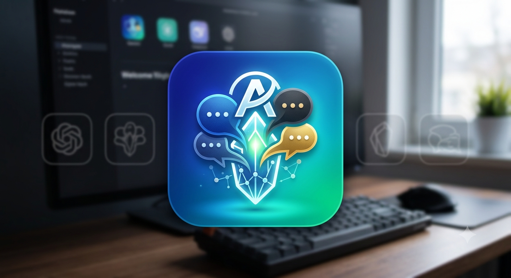

**English** | [Русский](README.ru.md)

# AI Chat Exporter



Desktop application that exports AI chat dialogs (**ChatGPT, Gemini, Claude, Qwen, DeepSeek**) into local Markdown files.
No API keys, no cloud services, no HTTP server.

## Features

- Export dialogs from **ChatGPT, Gemini, Claude, Qwen, DeepSeek**
- Files saved to `raw/<service>/*.md` — Cyrillic, attachments, metadata supported
- No API keys — works through CDP with a bundled Chromium browser (no system Google Chrome required)
- Export all dialogs (**Sync All**) or selected chats; per-provider cancel
- Self-contained installers — Python and Playwright are bundled, nothing to install

## Download

- **[AIChatExporter-Setup-0.5.0.exe](https://github.com/Nordggs/Projekt_AI_Base/releases)** — installer with Desktop and Start Menu shortcuts (recommended)
- **[AIChatExporter-Portable-0.5.0.zip](https://github.com/Nordggs/Projekt_AI_Base/releases)** — portable build, no installation required

## Installation

### Option 1 — Installer (recommended)

1. Run `AIChatExporter-Setup-0.5.0.exe`
2. Follow the wizard — Desktop and Start Menu shortcuts are created
3. Launch **AI Chat Exporter**

### Option 2 — Portable

Extract `AIChatExporter-Portable-0.5.0.zip` to any folder and run `AIChatExporter.exe`. Works without installation.

### From source

```bash
pip install -r requirements.txt
playwright install chromium
python main.py
```

For a dev run a system **Google Chrome** is used through CDP; release builds ship their own bundled Chromium.

## Usage

### General mechanism

The app launches a browser (bundled Chromium or system Chrome) with `--remote-debugging-port=9222`.
You sign in to provider accounts in the opened browser window — the session is saved in the profile
(`~/.ai_pipeline/chrome_gemini`), so you don't need to sign in again.

### ChatGPT / Gemini / Claude / Qwen

1. Launch Chrome via the provider card (**🚀 Запустить Chrome**)
2. Sign in to your account in the opened browser window
3. Click **Проверить подключение** (check connection)
4. Click **Синхронизировать** (sync) — the sidebar is scanned and all dialogs are exported

### DeepSeek

1. **Add Account** → paste the chat URL (`https://chat.deepseek.com/a/chat/s/{uuid}`)
2. Sign in to your account in the opened browser window
3. **Sync** — the dialog is exported to `raw/deepseek/`

## Output format

```markdown
<!-- hash: e7f89a title: chat title chat_order: 0 -->

#### 👤 Вы (2024-01-15 14:30)
user message

#### 🤖 AI
assistant message
```

File name: `{service}_{stable_id[:8]}_{hash6}.md`

## Project structure

```
├── main.py                      # Entry point (pywebview UI + 2 workers)
├── adapters/
│   ├── base.py                  # BaseAdapter ABC
│   ├── cdp_manager.py           # CDPManager (browser lifecycle) + CDPContext
│   ├── chatgpt.py               # ChatGPTAdapter
│   ├── claude.py                # ClaudeAdapter
│   ├── qwen.py                  # QwenAdapter
│   ├── gemini.py                # GeminiAdapter
│   └── deepseek.py              # DeepSeekAdapter
├── conversation/
│   ├── models.py                # ConversationModel (core)
│   ├── irbuilder.py             # IRBuilder: adapter → ConversationModel
│   ├── enrichment.py            # Enricher: CDP assets + runtime + blobs
│   ├── serializer.py            # serialization
│   └── validator.py             # validation
├── exporters/
│   ├── writer.py                # ExportWriter (atomic write, dedup, timestamps)
│   ├── gemini_extract.py        # Gemini DOM extraction
│   ├── chatgpt_extract.py       # ChatGPT DOM extraction
│   ├── claude_extract.py        # Claude DOM extraction
│   ├── qwen_extract.py          # Qwen DOM extraction
│   ├── deepseek.py              # DeepSeekExporter
│   └── attachment_capture.py    # CDP attachment capture
├── core/
│   └── logger.py                # LogBuffer (thread-safe)
├── ui/
│   ├── app.html                 # UI layout
│   ├── app.js                   # UI logic + pywebview bridge
│   ├── app.css                  # Styles + splash
│   └── icon.ico                 # Window icon
└── raw/                         # Output .md files
```

## Requirements

- Python 3.10+ (dev run)
- `pywebview>=4.0`
- `playwright>=1.40`
- Google Chrome (dev run only; release builds include bundled Chromium)

## Known limitations

- CDN/blob attachments that cannot be fetched are marked as `partial`; the chat itself is still exported

## License

Distributed under the MIT License — see [LICENSE](LICENSE).
Third-party components (Chromium, Playwright, PyWebView and others) are distributed under their own licenses — see [THIRD_PARTY_NOTICES.md](THIRD_PARTY_NOTICES.md).
